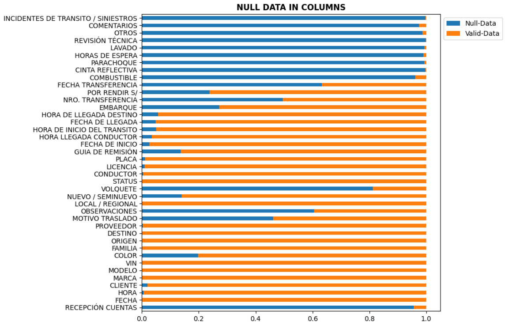
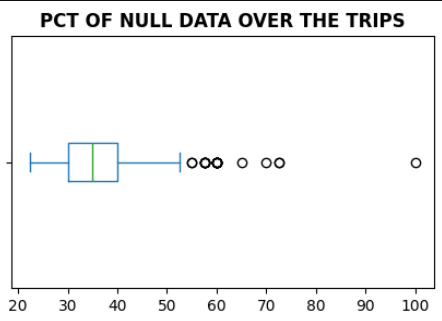
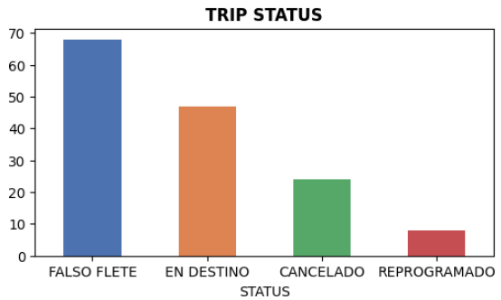

# Transportation Company Analysis


<p align = "center">


</p>


The main goal of this analysis is to identify the key variables this **"anonymous"** transport company records about their daily trips. This project primarily focuses on cleaning a chaotic dataset containing null values, redundant information, unconstrained domains, and non-atomic values.

<p align = "center">
<br>
 
</p>

The dataset exhibits significant data quality issues: 30% of all columns have null values in more than half of their entries. Every trip record contains at least some null values, with 75% of all records missing data in 20-40% of their attributes. 

## Data Cleaning 🗑️

The dataset's structure presents significant challenges for analysis. A substantial portion of the data contains null values, requiring an especially methodical approach to data cleaning. Throughout this process, I've prioritized data preservation, carefully evaluating each transformation to retain as much valuable information as possible.

1. Fill in the columns related to extra costs in a trip by using `'Missing'`values:
```py
extra_costs = ['COMBUSTIBLE', 'CINTA REFLECTIVA', 'PARACHOQUE', 
                'OBSERVACIONES', 'LAVADO', 'REVISIÓN TÉCNICA', 
                'OTROS', 'COMENTARIOS', 
                'INCIDENTES DE TRANSITO / SINIESTROS']
```
2. Fill in the `VOLQUETE` column, indicating whether it was necessary to use a tipper truck in the trip `[1, 0, 'Not Specified']`.

3. `HORAS DE ESPERA` (Waiting hours). It is the column with the most amount of null data (99.04%). It's is a derived attribute that must not be included in the logical schema of this datatset. We can calculate by the difference between `'HORA DE INICIO DEL TRANSITO'` (Transit start time) and `'HORA LLEGADA CONDUCTOR'` (Driver Arrival time). The big problem was that not all values of these columns were `date` objects. So, we had to cast them or get them by using the information of other variabes in the worst case.
    
    3.1. I was surprised that the company decided to store the status of a trip in the same column where the driver's arrival time or the start of the trip should be stored.

    3.2. There are trips whose `STATUS = EN DESTINO` (At Destination). However, there are nulls values in both `HORA LLEGADA CONDUCTOR` and `HORA DE INICIO DEL TRANSITO`<br> <p align = "center"></p>

> [!NOTE]
> More information about the meaning of the variable `STATUS` in `notebooks/data_cleaning.ipynb`.
