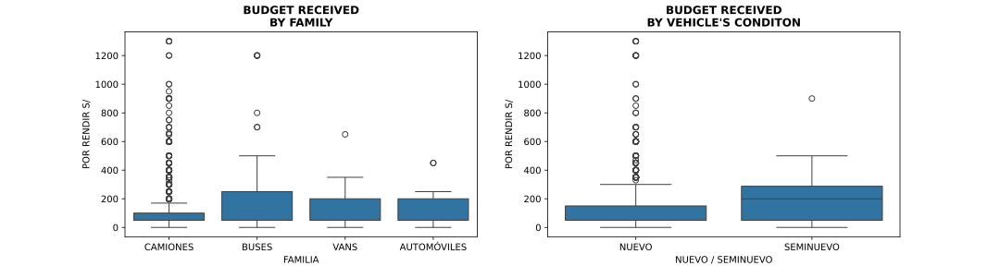

# Transportation Company Analysis


<p align = "center">


</p>

<p align="center">

</p>

The main goal of this analysis is to identify the key variables this **"anonymous"** transport company records about their daily trips. This project primarily focuses on cleaning a chaotic dataset containing null values, redundant information, unconstrained domains, and non-atomic values.

<p align = "center">
<br>
 
</p>

The dataset exhibits significant data quality issues: 30% of all columns have null values in more than half of their entries. Every trip record contains at least some null values, with 75% of all records missing data in 20-40% of their attributes. 

## Data Cleaning 🗑️

The dataset's structure presents significant challenges for analysis. A substantial portion of the data contains null values, requiring an especially methodical approach to data cleaning. Throughout this process, I've prioritized data preservation, carefully evaluating each transformation to retain as much valuable information as possible.

1. Fill in the columns related to extra costs in a trip by using `'Missing'`values:
```py
extra_costs = ['COMBUSTIBLE', 'CINTA REFLECTIVA', 'PARACHOQUE', 
                'OBSERVACIONES', 'LAVADO', 'REVISIÓN TÉCNICA', 
                'OTROS', 'COMENTARIOS', 
                'INCIDENTES DE TRANSITO / SINIESTROS']
```
2. Fill in the `VOLQUETE` column, indicating whether it was necessary to use a tipper truck in the trip `[1, 0, 'Not Specified']`.

3. `HORAS DE ESPERA` (Waiting hours). It is the column with the most amount of null data (99.04%). It's is a derived attribute that must not be included in the logical schema of this datatset. We can calculate by the difference between `'HORA DE INICIO DEL TRANSITO'` (Transit start time) and `'HORA LLEGADA CONDUCTOR'` (Driver Arrival time). The big problem was that not all values of these columns were `date` objects. So, we had to cast them or get them by using the information of other variabes in the worst case.
    
    3.1. I was surprised that the company decided to store the status of a trip in the same column where the driver's arrival time or the start of the trip should be stored.

    3.2. There are trips whose `STATUS = EN DESTINO` (At Destination). However, there are nulls values in both `HORA LLEGADA CONDUCTOR` and `HORA DE INICIO DEL TRANSITO`<br> <p align = "center"></p>
    I decided to fill the columns of `HORA LLEGADA CONDUCTOR`, `HORA DE INICIO DEL TRANSITO` with `'Unregistered'` for those trips are `FALSO FLETE` and `CANCELADO`. At this moment, I could know in which trips I could not get their waiting hours.<br>
> [!NOTE] More information about the meaning of the variable `STATUS` in `notebooks/data_cleaning.ipynb`.

4. `FECHA DE TRANSFERENCIA` (Transfer Date). This was a variable that the company didn't handle properly. While drivers could receive multiple transfers during a single trip, the company's system only recorded the first transfer received on the trip's start date.<br> This column has a lot of null data, but we can get it by using the data of another columns (`FECHA DE INICIO`). However, his raises two important questions: First, how should we handle cases where even the start date is unavailable? Second, even after imputation, can we be confident in the format integrity and validity of this derived dat
   
    4.1. First, we check the dtypes in `FECHA DE INICIO` (Start Date) and `FECHA DE LLEGADA` (Arrival Date). I want to analyze the latter, because it's important to check if the following relationship is met: $$\text{Arrival Date} \geq \text{Start Date}$$<br><div align="center" display="flex">
    
    
    </div>

    4.2. Analysis revealed that 98% of trips with both valid start and end dates (where the temporal relationship between these dates was logically consistent) also contained transit start times and arrival times in the correct format.<br><p align = "center"></p>

    4.3. It was possible to estimate the arrival date for these trips that had a consistent value on the start date variable by using the duration of trips with a similar route. To accomplish this  task, I created a class in `scripts/trip_management/date_types/datetimes/trip_duration.py`.


    4.4. I had to deal with start and arrival dates that were strings. The following table shows the different types of pairs that I have found.<table border="1">
  <thead>
    <tr>
      <th colspan="3" style="text-align: center;">Multi-index</th>
      <th rowspan="2" style="text-align: center; vertical-align: bottom;">freq</th>
    </tr>
    <tr>
      <th style="text-align: center;">Pair</th>
      <th style="text-align: center;">Column</th>
      <th style="text-align: center;">DType</th>
    </tr>
  </thead>
  <tbody>
    <tr>
      <td style="text-align: center;">1</td>
      <td style="text-align: left;">FECHA DE INICIO</td>
      <td style="text-align: left;">datetime.datetime</td>
      <td style="text-align: right;">59</td>
    </tr>
    <tr>
      <td style="text-align: center;">1</td>
      <td style="text-align: left;">FECHA DE LLEGADA</td>
      <td style="text-align: left;">str</td>
      <td style="text-align: right;">59</td>
    </tr>
    <tr>
      <td style="text-align: center;">2</td>
      <td style="text-align: left;">FECHA DE INICIO</td>
      <td style="text-align: left;">str</td>
      <td style="text-align: right;">115</td>
    </tr>
    <tr>
      <td style="text-align: center;">2</td>
      <td style="text-align: left;">FECHA DE LLEGADA</td>
      <td style="text-align: left;">str</td>
      <td style="text-align: right;">115</td>
    </tr>
  </tbody>
</table>
For the second pair, we got inconsistent values instead of dates in string format:
<p align = "center"></p>
4.5. It was also found dates that were floats. This behavior could be caused by NaN values, because NumPy handles them that way.
<table border="1">
  <thead>
    <tr>
      <th colspan="3" style="text-align: center;">Multi-index</th>
      <th rowspan="2" style="text-align: center; vertical-align: bottom;">freq</th>
    </tr>
    <tr>
      <th style="text-align: center;">Pair</th>
      <th style="text-align: center;">Column</th>
      <th style="text-align: center;">DType</th>
    </tr>
  </thead>
  <tbody>
    <tr>
      <td style="text-align: center;">1</td>
      <td style="text-align: left;">FECHA DE INICIO</td>
      <td style="text-align: left;">datetime.datetime</td>
      <td style="text-align: right;">47</td>
    </tr>
    <tr>
      <td style="text-align: center;">1</td>
      <td style="text-align: left;">FECHA DE LLEGADA</td>
      <td style="text-align: left;">float</td>
      <td style="text-align: right;">47</td>
    </tr>
    <tr>
      <td style="text-align: center;">2</td>
      <td style="text-align: left;">FECHA DE INICIO</td>
      <td style="text-align: left;">float</td>
      <td style="text-align: right;">52</td>
    </tr>
    <tr>
      <td style="text-align: center;">2</td>
      <td style="text-align: left;">FECHA DE LLEGADA</td>
      <td style="text-align: left;">float</td>
      <td style="text-align: right;">52</td>
    </tr>
    <tr>
      <td style="text-align: center;">3</td>
      <td style="text-align: left;">FECHA DE INICIO</td>
      <td style="text-align: left;">float</td>
      <td style="text-align: right;">1</td>
    </tr>
    <tr>
      <td style="text-align: center;">3</td>
      <td style="text-align: left;">FECHA DE LLEGADA</td>
      <td style="text-align: left;">datetime.datetime</td>
      <td style="text-align: right;">1</td>
    </tr>
  </tbody>
</table>
I could only work with pair 1, where I have to proceed the same way if there are valid start dates, estimating the arrival date by using the duration of trips with similar route.

---
At this point, I was able to significantly reduce the null values in the dataset. However, simply filling missing values with 'Unregistered' is not the most optimal approach from a data integrity perspective.
When designing a proper database following conceptual and logical schema principles, we would handle this situation differently. 

For example, a well-designed system would enforce data entry constraints requiring employees to ALWAYS register both start and arrival dates, as well as start and arrival times for each trip. In such a system, null values would only be permitted in specific scenarios, such as when a trip needed to be cancelled or rescheduled.<p align = "center"></p>

---
5. `POR RENDIR` (Budget). This is a discrete variable that represents the amount of money that a driver received for his trip. For consistency, it's only possible to estimate this data if a transfer date was recorded.<br>The most strange was that there are trips that have been done, but in the budget column are registeres hyphen values ('-') for some reason:<p align = "center"></p><br>On the other hand, I have built the "Budget Table" with the help of the records that had a consistent value for this variable. If you are interest about the process, don't dude to visit `scripts/trip_expenses/budget.py` ⛏️.<br> I had to make an analysis to find our if there were differences between the budget that a driver received according to the type (`FAMILY`) and condition (`CONDITION`) of the vehicle used in the trip .<br><br><ul><li>The box plot "BUDGET RECEIVED BY FAMILY" reveals distinct distribution patterns across vehicle types. Trucks (camiones) display a positively skewed distribution with approximately 80% receiving between S/.$[0, 200]$, alongside notable outliers reaching up to 10 times the median value.<br>Buses show an interesting pattern where the median is relatively low (around 50 soles), yet the upper quartile extends beyond 250 soles, indicating significant variability in budget allocation.<br>Vans and automobiles demonstrate similar distribution characteristics to buses, with comparable medians and several high-value outliers. This variability across all vehicle categories could be attributed to the combination of local and regional trip data in the dataset, where regional trips likely command higher budgets.</li><li>
The box plot "BUDGET RECEIVED BY VEHICLE'S CONDITION" demonstrates a pronounced difference in budget distribution patterns between new and semi-new vehicles. Semi-new vehicles exhibit substantially greater variability, with a wider interquartile range (approximately 100-500 soles) and a higher median value (around S./$[250, 300]$). This increased dispersion aligns with the practical reality that semi-new vehicles typically require additional investments for maintenance components like bumpers, reflective tape, and other regulatory compliance measures such as technical inspection renewals.<br> Notably, despite this tighter central distribution, new vehicles paradoxically present more extreme outliers, with several data points reaching up to S/.1200 – suggesting exceptional cases where new vehicles demanded substantial budgets.
</li>
</ul>

I have to check if the high variability is caused for mixing trips with short (`LOCAL`) and long (`REGIONAL`) distance:
<p align = "center">

</p>
As expected, regional trips consistently receive substantially higher budget allocations than local trips across all vehicle types, confirming the hypothesis that longer trips necessitate additional funding for fuel, accommodation, and other travel-related expenses. 

Trucks and buses exhibit the highest median regional budgets (approximately S/.$[350, 400]$ soles and S/.$300$ respectively) with considerable interquartile ranges, suggesting significant variability even within regional categories. 

The presence of extreme outliers, particularly in the regional truck and bus categories (reaching up to 1300 soles), indicates exceptional cases requiring extraordinary funding. Interestingly, a new category called `LOCAL/REGIONAL` appears, where it's predominantly in the truck segment with a moderate budget distribution.

 The minimal overlap between local and regional distributions for trucks, buses, and vans supports the differentiated budgeting approach based on trip scope. However, the presence of high outliers in local trips and low outliers in regional trips confirms the user's observation that some local trips receive comparable funding to regional ones.


 ##    Distance Table  

 Finally, I created a table with the distances between the various routes registered in the database. But there was a problem about how the `ORIGIN` and `DESTINATION` were saved, because there are some missing a character, others unnecessary extra characters, words together when they are separated.

 So I thought it would be a good idea to represent these strings as embeddings to recognize which words are similar, **syntactically**, to other words using cosine similarity. This way I can keep only the original ones. I used the all-MiniLM-L6-v2 model from Hugging Face for this task. You cand find it <a href = "https://huggingface.co/sentence-transformers/all-MiniLM-L6-v2">here</a>.

<p align = "center">

</p>